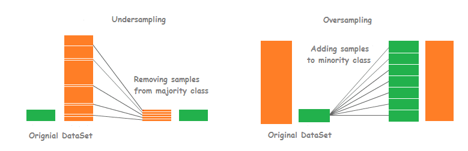

# Machine Learning development over Spotify data 🎶

## Description

@letpires proposed this project as part of the #7DaysOfCode initiative organized by @alura. The challenge revolves around analyzing Spotify data and applying Machine Learning methodologies to predict the popularity of songs. Participants will gain hands-on experience in data manipulation, visualization, and analysis using the Python language.

This endeavor offers a chance for individuals unfamiliar with the subject to delve into Machine Learning, a technique enabling algorithms to "learn" specific tasks from data. Rather than explicitly programming rules for every scenario, a model is trained to recognize patterns within data, facilitating decision-making based on these identified patterns. The project encompasses various stages of a Machine Learning endeavor, spanning from data collection and exploratory analysis to model validation.

## Chapter 1: Exploratory Analysis 🕵️‍♂️

Exploratory data analysis assumes a pivotal role in comprehensively grasping the intricacies of the data at hand[ˆ1]. When applied to Spotify music data, it aids in unveiling patterns, trends, and relationships among variables. This analytical process proves instrumental in extracting valuable insights related to the determinants of song popularity on Spotify, encompassing factors like musical attributes, song duration, music genres, popular artists, and other relevant aspects.

Engaging in this preliminary analysis not only unveils crucial insights within the data but also contributes to the construction of more resilient machine learning models for predicting song popularity on the Spotify platform. Additionally, exploratory analysis serves as a vital tool for detecting potential data issues, including missing values or inconsistencies, necessitating resolution before embarking on the creation of machine learning models.

## Chapter 2: Data Pre-process ⚙️

Machine learning encompasses three primary types: supervised, unsupervised, and reinforcement learning. This challenge specifically delves into supervised learning, which revolves around predicting an output variable based on a set of input variables. Within supervised learning, there are two focal categories: classification and regression. The emphasis in this challenge lies in constructing a classification model designed to predict whether a song will attain popularity or not.

The objective of predicting song popularity serves practical purposes, aiding in informed marketing decisions and enhancing the likelihood of a song's success. However, before delving into model creation, the crucial step of data preprocessing must be undertaken. This phase is pivotal in the machine learning process, involving the cleaning, organization, and transformation of raw data into a format suitable for model training. Various data preprocessing techniques, such as removing duplicate data, filling missing values, normalizing data, and feature engineering, can be applied to optimize the available data for subsequent modeling efforts.

## Chapter 3: Dataset division ➗

In the ongoing challenge, participants are tasked with the crucial process of partitioning their data into training, validation, and testing sets as a prerequisite before embarking on machine learning model development.

The significance of data partitioning lies in the objective of impartially evaluating the model's performance. Utilizing the entire dataset for training hinders the ability to gauge its effectiveness in generalizing to new data and acts as a precaution against overfitting[ˆ2], ensuring the model's competency extends beyond the training data. The training data serves as instruction for the model, while the testing data evaluates its performance on unfamiliar data, and the validation data aids in fine-tuning the model's hyperparameters for enhanced overall performance.

Several techniques exist for data partitioning, with random division being a common method allocating 70-80% for training, 10-20% for testing, and another 10-20% for validation. Despite its simplicity, this method may not be optimal for addressing data imbalances. Alternatively, cross-validation, exemplified by StratifiedKFold, is recommended to assess the model's generalization across diverse datasets and mitigate overfitting, particularly advantageous for handling unbalanced datasets. Following data partitioning, the subsequent step involves segregating the set into explanatory variables (X) such as musical genre and song duration and the output variable (Y) indicating the song's popularity, a variable participants aim to predict. The challenge encourages the use of cross-validation, specifically StratifiedKFold, with participants urged to compare its performance against other data partitioning techniques, underscoring the critical role of data splitting in influencing the machine learning process outcomes.

## Chapter 4: Baseline of the First Model 📈

This step involves establishing your inaugural Machine Learning model, commonly referred to as the baseline. This initial model serves as a foundational benchmark, representing a rudimentary solution to the problem at hand. Typically, after establishing the baseline, more intricate models are explored in an attempt to achieve improved results. Success is measured by surpassing the performance of the baseline model.

The baseline model, being a simplistic solution, aids in discerning whether the underlying challenge is associated with bias or variance. If the baseline model exhibits notably low accuracy, it may signal the complexity of the problem, indicating the necessity for a more advanced model to address it. Logistic Regression is frequently employed as a baseline model in classification tasks due to its simplicity and ease of interpretation. Despite its name suggesting regression, Logistic Regression is utilized for classification purposes. However, other classification models, such as Naive Bayes, Random Forest, Decision Tree, XGBoost, and others, are also viable options to explore beyond Logistic Regression. Commence the process by establishing the initial baseline model, defining the model, instantiating it, training it with the available data, and subsequently making predictions on both training and validation datasets.

## Chapter 5: Model Validation 🧪

Utilizing appropriate validation metrics for Machine Learning models is crucial in a project. The value of these metrics reflects the quality of a model; therefore, if poorly chosen, it may be impossible to assess whether the model meets the necessary requirements. The evaluation of a classification model is based on comparing the classes predicted by the model with the true classes of each example. All metrics aim to measure how far the model is from a perfect classification, but they do so in different ways. A simple way to visualize the performance of a model is through the confusion matrix, as shown in the figure.

Applied to the challenge at hand: 
- TP (true positive): the model correctly predicts a popular song;
- TN (true negative): the model correctly predicts a non-popular song;
- FN (false negative): the model predicts a song as popular, but it's not;
- FP (false positive): the model predicts a song as non-popular, but it is popular.

In addition to this metric, others can be used, such as Accuracy, which shows how many classifications the model got right among all; Precision, indicating how many of the model's Popular class classifications are correct; Recall, showing how many of the expected Popular class situations are correct; and F1-score, the harmonic mean between precision and recall. The choice of metric depends on the project's goal and the dataset characteristics. If the aim is to minimize false positives, precision will be the most important metric. If the goal is to minimize false negatives, recall will be the most important metric.

## Chapter 6: Resample the data and fit the selected model 🔄🤖

Resampling is a technique used in machine learning to address imbalances in data. When dealing with a dataset where one class is significantly smaller than the other, it can impact the model's accuracy. Resampling becomes a useful technique in such cases to balance the number of instances in each class. The popularity cutoff point discussed on day 2 plays a crucial role here. Setting a cutoff at 50 may indicate less imbalance, but raising it to 80, for instance, may reveal a much lower proportion of popular songs. This imbalance leads to the model exhibiting a tendency to generate many "false alarms," performing well for the majority class (non-popular) but less effectively for the minority class (popular).
*Oversampling* and *undersampling* are two techniques employed to address imbalanced data. Undersampling involves reducing the number of observations in the majority class, while oversampling aims to increase the number of observations in the minority class, either by creating new samples or duplicating existing ones.

In the current challenge, the task involves balancing the popularity classes of songs using at least two techniques for performance metric comparison. Once data resampling is complete, the next step is to fine-tune the model by defining and testing various hyperparameters for optimal performance. Hyperparameters are model parameters not learned during training and must be set by the user, such as the number of trees in a random forest model. Identifying the best model hyperparameters allows for model retraining. Keep in mind that the ultimate project goal is to create a machine learning model capable of accurately predicting the popularity of songs on Spotify, urging exploration of diverse techniques and approaches for the best possible outcome.

## Chapter 7: Apply the result to the test data and save the result 💾

For the last step, he chosen classification model will be applied to the test data, and the results will be saved. Recall that a portion of the data was set aside for testing. Now is the time to assess how the model performs on data it has never encountered before.

Additionally, do not forget to serialize the model at the end of this process. In other words, generate a file with the saved model so that it can be later loaded into other projects or shared with others. Throughout the challenge, various changes and adaptations were necessary for the data (normalization, removal of unnecessary columns, data balancing, etc.) to fit the model. All of these alterations changed the original structure of your data. While saving the model, it's not mandatory to revert to the original data. However, it is essential to document all data transformations applied to the original data and save the model along with this information for future reference. It is recommended to explore how to revert to the original data along with the details provided by the model, keeping in mind that different approaches may be needed based on the methods used, such as calling the inverse function `fit_resample()` if `RandomOverSampler` was utilized.

## Next steps
After creating a model, the next step involves deploying it for practical use in real projects. The deployment process allows the model to be integrated into applications, enabling users to make predictions or identify patterns. Determining how people will utilize the model is crucial at this stage. This post provides a comprehensive introduction to model deployment, while this article offers a practical application.

Another critical aspect post-model creation is the retraining model. It's essential to question whether the model remains valid for new workloads. Given the experimental nature of machine learning, ongoing monitoring of data and experiments is necessary to assess the model's performance based on metrics. Predictions may age, data might become outdated, or new patterns may emerge, rendering the original model incapable of capturing these changes.

Various guidelines, including those in Martin Zinkevich's article "Rules of Machine Learning," highlight the importance of focusing on analyzing and improving a current model. Zinkevich emphasizes the art of model analysis and improvement, introducing anti-patterns to avoid pitfalls. Notably, he suggests practices like measuring the delta between models, calculating the difference between new results and production. This insightful article provides valuable recommendations for navigating the intricacies of machine learning.

[ˆ1]: [Spotify Tracks Dataset - kaggle.com](https://www.kaggle.com/datasets/maharshipandya/-spotify-tracks-dataset?utm_campaign=%5Bb2c%5D+7DoC+Machine+Learning+1ª&utm_medium=email&_hsmi=270747671&_hsenc=p2ANqtz-_TdkyyyoSw-tOJTWLTaM2NPSTob2dkV01KqWfLfkHN3jJ0pt9SQrtEkkzFKmiM5NbRLIvXeN6UMBg1eGfEaKRSdjbH2A&utm_content=270747671&utm_source=hs_automation)

[ˆ2]: [ML | Underfitting and Overfitting - geeksforgeeks.org](https://www.geeksforgeeks.org/underfitting-and-overfitting-in-machine-learning/)